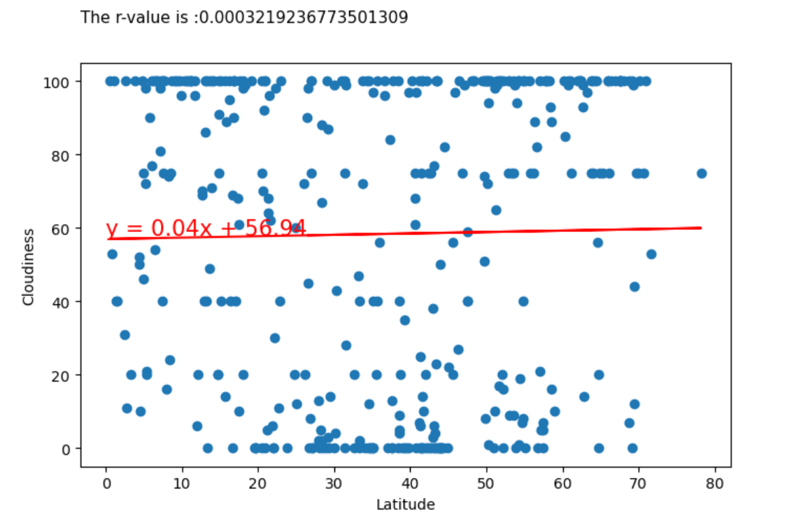

# python-api-challenge
 Use the Weather Map API & Shows Visulaizations with Linear Regression  

# Weather APIs wiht Linear Regression 

### 1 Introduction 

- Here we  will use the weather APIs and view the weather for more than 500 cities.

- Perfoming some different operations we generate random geographic coordinates and the nearest city to each latitude and longitude combination is provided.

- Also use the Geopigy API to map that displays a point for every city and hotels for vacations.

### 2 Relationship between Weather Variables vs. Latitude 

- Here will get the data from the API and perform the visualization to get observations for weather varibales against the latitude of different cities.

- Here is the sample data frame to show

- Next will be presentation of the plots with some observations.

####  2.1 Scatter Plot for Latitude Vs. Temperature

- The plots depicts the random data retrieval and there diversity of the plots between latitude and temperature.

#### 2.2 Scatter Plot for Latitude Vs. Humidity

- The plot shows a lot of scatter points on the plot graph and have no linera pattern.

#### 2.3 Scatter Plot for Latitude Vs. Cloudiness

- The whole plot shows all values differs in random pattern and there is not strong relation betwwen them.

#### 2.4 Scatter Plot for Latitude Vs. Windspeed

- T The plot shows a lot of scatter points on the plot graph and have no linera pattern.

#### 3 Linear Regression  for Each Relationship

#### 3.1 Temperature vs. Latitude Linear Relationship

### From Northern Hemisphere

- It can be seen that the correlation coefficient is 0.6 there is good correlation.

- As the gardient is -0.4 and the linear regression line is negative.

- It shows in northern hemisphere, latitude have asignificant linear realtionship. As if the latitude changes, there will be negative changes in the temperature.

### From Southern Hemishere
- It can be seen that the correlation coefficient is 0.5 there is decent correlation.

- As the gardient is 0.4 and the linear regression line is almost 45 degree.

- It shows in southern hemisphere, latitude have asignificant linear realtionship. As if the latitude changes, there will be relative change in the temperature.

### 3.2 Humidity  vs. Latitude Linear Relationship

### From Northern Hemisphere

- It shows that the correlation coefficient is quite about 0 and there is almost no  correlation between humidity and latitude.

- In northern hemisphere, latitude have a very weak linear realtionship. As if the latitude changes, there will be no changes in the humidity. 

- As the gardient is also clolse to 0 and the linear regression line is almost prallel to the x-axis. 

### From Southern Hemishere

- It can be seen that the correlation coefficient is about neagitive 0 and we can depicts that there is very weak correlation.

- As the gardient is also clolse to 0 and the linear regression line is almost prallel to the x-axis. 

- It shows in southern hemisphere, latitude have a very weak linear realtionship. As if the latitude changes, there will be almsot no change in the humidity. 

### 3.3 Cloudiness vs. Latitude Linear Relationship

### From Northern Hemisphere

- It shows that the correlation coefficient is almost 0 and we can depicts that there is almost no  correlation between cloudiness and latitude.

- In northern hemisphere, latitude have a very weak linear realtionship. As if the latitude changes, there will be no changes in the cloudiness. 

- As the gardient is also clolse to 0 and the linear regression line is almost prallel to the x-axis. 

### From Southern Hemishere

- It can be seen that the correlation coefficient is almost 0 and we can depicts that there is very weak correlation.

- As the gardient is also clolse to 0 and the linear regression line is almost prallel to the x-axis. 

- It shows in southern hemisphere, latitude have a very weak linear realtionship. As if the latitude changes, there will be almsot no change in the cloudiness. 

### 34 Wind Speed vs. Latitude Linear Relationship

### From Northern Hemisphere

- It crystal clear the correlation coefficient is almost 0 and we can depicts that the correlation is almost have near to no such a linear relationship.

- In northern hemisphere, latitude have a very weak linear realtionship. As if the latitude changes, there will be no changes in the wind speed. 

- As the gardient is also clolse to 0 and the linear regression line is almost prallel to the x-axis. 

### From Southern Hemishere

- It can be seen that the correlation coefficient is almost 0 and we can depicts that the correlation is poor and have weak linear relationship.

- As the gardient is also clolse to 0 and the linear regression line is almost prallel to the x-axis. 

- It shows in southern hemisphere, latitude have a very weak linear realtionship. As if the latitude changes, there will be no significant change in the wind speed. 

# Map Visualizations

- Let's use the cities.csv file that was created using weather API scripting to work on the map visualizations.

### 4.1 Map that displays a point for every city in the city_data_df DataFrame

### 4.2 : Narrow down the city_data_df DataFrame 

- To find your ideal weather condition.

### 4.3 City Humidity Map

- Add the hotel name and the country as additional information in the hover message for each city in the map.

